```markdown
# 🛡️ CryptoGuard: MLOps Financial Intelligence System


**CryptoGuard** is an enterprise-grade **MLOps (Machine Learning Operations)** system designed to provide real-time cryptocurrency forecasting, institutional risk analysis ("Whale Tracking"), and automated customer segmentation.

The project demonstrates a complete **End-to-End Machine Learning Pipeline**, including automated retraining, model selection tournaments, and Dockerized deployment to the cloud.

---

## 🚀 Live Demo
**👉 [Click Here to Launch App](https://huggingface.co/spaces/Moosa-7/CryptoGuard)** *(Hosted on Hugging Face Spaces)*

---

## 🧠 Key Features

### 1. 💰 Bitcoin Price Forecaster (XGBoost)
* **Real-time Prediction:** Forecasts whether to **BUY** or **SELL** Bitcoin based on live market data.
* **Technical Indicators:** Analyzes Volatility, Moving Averages (7D/30D), and Volume Momentum.
* **Confidence Score:** Provides a probability score for every prediction.

### 2. 🐋 Institutional "Whale" Tracker
* **Insider Intel:** Tracks massive Bitcoin holders by analyzing proxy stocks like **MicroStrategy (MSTR)**, **Coinbase**, and **Marathon Digital**.
* **Wall Street Scanner:** Identifies if giants like **BlackRock** or **Vanguard** are increasing their exposure.
* **Whale Confidence Score:** A calculated metric (0-100%) showing institutional sentiment.

### 3. 📊 Market Correlation Matrix
* **Risk Radar:** visualizes how Bitcoin correlates with **S&P 500**, **Gold**, and the **US Dollar**.
* **AI Diagnostics:** Automatically detects market regimes:
    * 🔴 **Risk-On:** Bitcoin is acting like a Tech Stock.
    * 🟢 **Safe Haven:** Bitcoin is acting like Digital Gold.
    * 🛸 **Decoupled:** Bitcoin is driven by crypto-specific events (Halving/Regulation).

### 4. 👥 AI Customer Segmentation (AutoML)
* **Behavioral Clustering:** Classifies users into **"Standard"** vs. **"VIP / High-Net-Worth"** tiers.
* **AutoML Tournament:** Automatically trains **K-Means**, **GMM**, and **Birch** algorithms, selects the winner based on Silhouette Score, and deploys it.
* **Hybrid Logic:** Combines ML predictions with business rule guardrails for 100% accuracy.

---

## 🏗️ System Architecture

The system follows a **Microservices Architecture** wrapped in a single Docker container for efficient deployment.

```mermaid
graph LR
    User((👤 User)) -->|HTTPS| UI[Streamlit Frontend]
    UI -->|Internal API| API[FastAPI Backend]
    
    subgraph "Machine Learning Core"
        API -->|Load| XGB[XGBoost Forecaster]
        API -->|Load| KM[Segmentation Engine]
    end
    
    subgraph "External Data"
        UI -->|Fetch| YF[Yahoo Finance API]
        UI -->|Fetch| SEC[SEC 13F Filings]
    end

```



---

## 🛠️ Tech Stack

| Component | Technology |
| --- | --- |
| **Language** | Python 3.12 |
| **Frontend** | Streamlit |
| **Backend** | FastAPI, Uvicorn |
| **ML Models** | XGBoost, Scikit-Learn (K-Means, GMM) |
| **Data Source** | yfinance (Yahoo Finance API) |
| **Containerization** | Docker |
| **CI/CD** | GitHub Actions |
| **Version Control** | Git LFS (Large File Storage) |

---

## ⚡ Setup & Installation

### Prerequisites

* Python 3.10+
* Git & Git LFS
* Docker (Optional)

### 1. Clone the Repository

```bash
git clone [https://github.com/Moosa-7/CryptoGuard-MLOps.git](https://github.com/Moosa-7/CryptoGuard-MLOps.git)
cd CryptoGuard-MLOps

# IMPORTANT: Pull the large model files
git lfs install
git lfs pull

```

### 2. Install Dependencies

```bash
pip install -r requirements.txt

```

### 3. Run Locally (Dual-App Mode)

We use a shell script to start both Frontend and Backend simultaneously.

```bash
# Make script executable (Linux/Mac)
chmod +x entrypoint.sh

# Run
./entrypoint.sh

```

* **Dashboard:** `http://localhost:8501`
* **API Docs:** `http://localhost:8000/docs`

---

## 🔄 MLOps Pipeline (CI/CD)

This project uses **GitHub Actions** to automate the entire lifecycle:

1. **Continuous Integration (CI):**
* Lints code with `Flake8`.
* Runs Unit Tests with `Pytest`.


2. **Continuous Training (CT):**
* Retrains XGBoost & Segmentation models on fresh data.
* Runs an "Algorithm Tournament" to pick the best clustering model.
* Saves artifacts (`.pkl` files) to the repo.


3. **Continuous Delivery (CD):**
* Builds a new Docker Image.
* Pushes to **GitHub Container Registry (GHCR)**.
* Deploys to **Hugging Face Spaces**.


---

## 🐳 Docker Deployment

To build and run the container manually:

```bash
# Build
docker build -t cryptoguard .

# Run
docker run -p 8501:8501 -p 8000:8000 cryptoguard

```

---

## 📂 Project Structure

```text
CryptoGuard-MLOps/
├── .github/workflows/   # CI/CD Pipelines (YAML)
├── models/              # Trained ML Models (.pkl)
├── src/
│   ├── api/             # FastAPI Backend
│   │   └── main.py
│   ├── ui/              # Streamlit Dashboard
│   │   └── dashboard.py
│   ├── models/          # Training Scripts
│   │   └── train_model.py
│   └── utils/
├── tests/               # Unit Tests
├── Dockerfile           # Container Config
├── entrypoint.sh        # Startup Script
├── requirements.txt     # Dependencies
└── README.md            # You are here

```

---

## 📄 License

This project is licensed under the MIT License - see the LICENSE file for details.

**Author:** Muhammad Moosa

**Contact:** u2023469@giki.edu.pk

```

```
